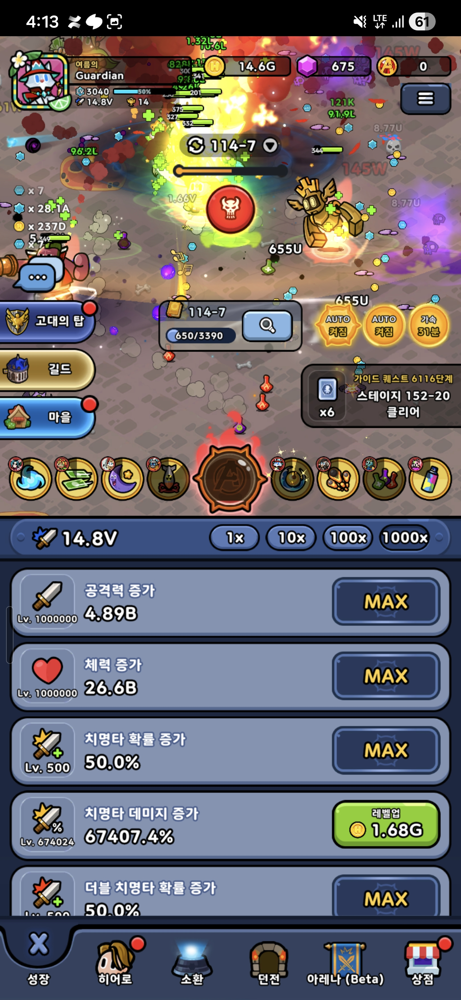

# 목표 게임 레퍼런스

## 기준 이미지



이 이미지는 최종 게임의 화면 밀도, 버튼 배치, 전투/성장 동시 노출 방식, 재화 표시 방식을 기억하기 위한 기준이다.

## 핵심 감각

- 접속하면 전투가 이미 진행 중이어야 한다.
- 화면 상단은 재화와 현재 진행 정보를 보여준다.
- 중앙은 자동전투, 드랍, 데미지 숫자, 스테이지 진행을 보여준다.
- 하단은 성장, 히어로, 소환, 던전, 아레나, 상점 같은 주요 메뉴를 고정한다.
- 성장 화면은 리스트형이며, 각 항목은 아이콘, 레벨, 수치, 레벨업 버튼을 가진다.
- 버튼과 정보량은 많아도 된다. 이 장르는 깔끔한 미니멀 UI보다 반복 성장 조작의 접근성이 중요하다.

## 그대로 베끼면 안 되는 것

- 원본 캐릭터 디자인
- 원본 UI 아이콘
- 원본 배경/이펙트
- 원본 명칭과 로고
- 원본 배치의 픽셀 단위 복제

참고해야 할 것은 시스템 구조와 UX 밀도다.

## 성장 능력치

능력 성장 항목은 다음 7개를 기준으로 한다.

| ID | 이름 | 설명 | 1차 MVP 반영 |
| --- | --- | --- | --- |
| attackPower | 공격력 | 기본 데미지 증가 | 예 |
| maxHp | 체력 | 생존력 증가. 1차 MVP 전투에는 사망이 없으므로 표시만 가능 | 보류 |
| criticalChance | 치명타 확률 | 일정 확률로 치명타 발생 | 예 |
| criticalDamage | 치명타 데미지 | 치명타 배율 증가 | 예 |
| doubleCriticalChance | 더블 치명타 확률 | 치명타 발생 후 추가 확률로 더블 치명타 발생 | 보류 |
| doubleCriticalBonusDamage | 더블 치명타 추가 데미지 | 더블 치명타 발생 시 추가 배율 | 보류 |
| finalDamage | 최종 데미지 | 모든 계산 후 최종 배율 증가 | 보류 |

1차 MVP에서는 공격력, 치명타 확률, 치명타 데미지만 먼저 넣는 편이 맞다. 나머지는 계산식과 밸런스 복잡도를 늘리기 때문에 자동전투 루프가 검증된 뒤 넣는다.

## 데미지 계산 방향

최종 목표 계산식은 아래 구조를 따른다.

```text
기본 데미지 = 영웅 공격력 + 능력 공격력 보너스
치명타 적용 데미지 = 기본 데미지 * 치명타 데미지 배율
더블 치명타 적용 데미지 = 치명타 적용 데미지 * 더블 치명타 추가 배율
최종 데미지 = 적용 데미지 * 최종 데미지 배율
```

주의점:

- 치명타와 더블 치명타를 너무 일찍 넣으면 데미지 편차가 커져 보스 밸런스가 흔들린다.
- `최종데미지`는 가장 강한 증가 항목이므로 초반 성장 항목으로 싸게 제공하면 밸런스가 빠르게 망가진다.
- `체력`은 적 공격, 영웅 사망, 생존 체크가 들어간 뒤 의미가 생긴다. 1차 MVP에는 전투 패배가 없으므로 우선순위가 낮다.

## 재화 구조

| ID | 이름 | 용도 |
| --- | --- | --- |
| gold | 골드 | 능력 성장, 일반 강화 |
| ruby | 루비 보석 | 뽑기권이 없을 때 뽑기 비용으로 사용 |
| heroExpItem | 히어로 경험치 아이템 | 히어로 레벨업 |
| eventSummonTicket | 이벤트 뽑기권 | 이벤트 뽑기 |
| heroSummonTicket | 히어로 뽑기권 | 히어로 뽑기 |
| sealSummonTicket | 인장 뽑기권 | 인장 뽑기 |
| equipmentSummonTicket | 장비 뽑기권 | 장비 뽑기 |

중요한 수정:

- 히어로 레벨업은 골드가 아니라 `히어로 경험치 아이템`으로 한다.
- 골드는 계정 능력 성장에 먼저 사용한다.
- 뽑기는 전용 뽑기권을 먼저 소모하고, 뽑기권이 없을 때 루비를 소모한다.

## 뽑기 종류

| ID | 이름 | 우선 소모 재화 | 대체 소모 재화 | 결과 |
| --- | --- | --- | --- | --- |
| eventSummon | 이벤트 뽑기 | 이벤트 뽑기권 | 루비 | 이벤트 한정 보상 |
| heroSummon | 히어로 뽑기 | 히어로 뽑기권 | 루비 | 히어로 또는 히어로 조각 |
| sealSummon | 인장 뽑기 | 인장 뽑기권 | 루비 | 인장 |
| equipmentSummon | 장비 뽑기 | 장비 뽑기권 | 루비 | 장비 |

## 뽑기 비용 규칙

```text
뽑기권 보유 수량 >= 요청 횟수
→ 뽑기권 소모

뽑기권 부족
→ 부족한 횟수만큼 루비 비용 계산
→ 루비가 충분하면 루비 소모
→ 루비도 부족하면 뽑기 불가
```

1회, 10회, 100회 같은 다중 뽑기는 나중에 넣는다. 1차 MVP에서는 1회와 10회만 있으면 충분하다.

## 성장 화면 방향

성장 화면은 아래 리스트 구조를 따른다.

```text
능력 총 전투력
배율 선택: 1x / 10x / 100x / 1000x

능력 항목 1
  아이콘
  현재 레벨
  능력 이름
  현재 수치
  레벨업 비용 또는 MAX

능력 항목 2
...
```

첫 구현에서는 아래 3개만 만든다.

- 공격력 증가
- 치명타 확률 증가
- 치명타 데미지 증가

체력, 더블 치명타, 최종 데미지는 데이터만 잡고 UI/계산은 뒤로 미룬다.

## 1차 MVP에 반영할 것과 미룰 것

### 바로 반영

- 재화에 `루비`, `히어로 경험치 아이템`, 뽑기권 개념 추가
- 히어로 레벨업 비용을 골드에서 히어로 경험치 아이템으로 변경
- 뽑기 타입을 이벤트, 히어로, 인장, 장비로 분리할 수 있는 구조로 설계
- 능력 성장 항목의 데이터 모델 추가

### 뒤로 미룸

- 100회, 1000회 뽑기
- 이벤트 픽업
- 인장/장비 실제 장착 효과
- 더블 치명타 실제 계산
- 최종 데미지 실제 계산
- 원본 수준의 이펙트와 데미지 숫자 연출

## 냉정한 판단

이 구조를 전부 지금 넣으면 MVP가 망가진다. 특히 뽑기 4종, 장비, 인장, 더블 치명타, 최종 데미지를 동시에 구현하면 테스트할 수 있는 게임이 아니라 미완성 메뉴 묶음이 된다.

따라서 다음 구현 순서는 다음이 맞다.

```text
1. 현재 자동전투 루프 유지
2. 재화를 gold, ruby, heroExpItem으로 확장
3. 히어로 레벨업을 heroExpItem 사용으로 변경
4. 능력 성장 3종 추가: 공격력, 치명타 확률, 치명타 데미지
5. 히어로 뽑기만 먼저 정리
6. 이후 이벤트/인장/장비 뽑기 확장
```
